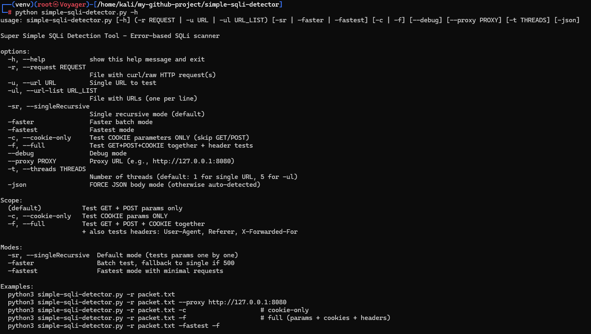
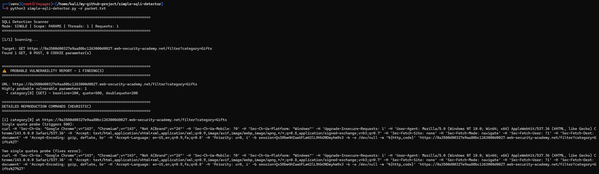
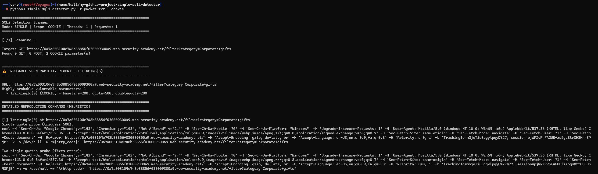
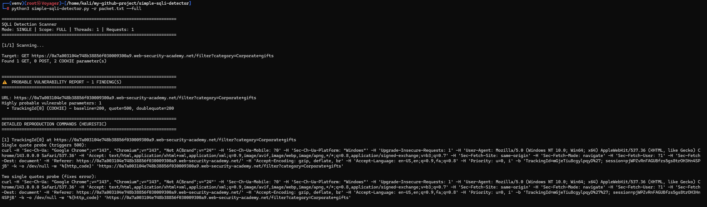

# Simple SQLi Error-Heuristic Scanner `simple-sqli-detector.py`

A lightweight **error-based SQLi heuristic scanner** that looks for **500 → non-500** transitions after appending `'` and then `''` to inputs.

✅ Supports:
- Raw Burp requests (multiple requests per file)
- curl commands exported from Burp
- URL / URL list scanning
- Form + **auto-detected JSON** bodies (no `-json` needed)
- Cookie-only mode
- Full mode (params + cookies + UserAgent + Referer + X-Forwarded-For)

> ⚠️ This tool is **heuristic**. “500 on `'` and non-500 on `''`” can strongly suggest SQL parsing, but **is not 100% proof** of SQLi.

---

## Features

- **Modes**
  - `-sr / --singleRecursive` (default): tests params one by one recursively
  - `-faster`: batch test, falls back to single mode if 500 occurs
  - `-fastest`: minimal requests, falls back to identify param(s)

- **Scopes**
  - Default: tests **GET + POST params only**
  - `-c, --cookie-only`: tests **COOKIE params only**
  - `-f, --full`: tests **GET + POST + COOKIE + headers**
    - Header probes: `User-Agent`, `Referer`, `X-Forwarded-For` (added if missing)

- **Quality-of-life**
  - Auto JSON detection (Content-Type or valid JSON body)
  - Removes `Content-Length` from raw requests so `curl` recalculates it after mutation
  - Safe multi-request parsing (won’t break on the normal header/body blank line)

---

## Install

Requires: `python3` + `curl to be already installed on your system`

chmod +x simple-sqli-detector.py

(Optional) Use a proxy (Burp/ZAP):
--proxy http://127.0.0.1:8080

---

## Usage

1) Scan a raw Burp request file:
python3 simple-sqli-scanner.py -r packet.txt

2) Scan multiple Burp requests in a single file:
python3 simple-sqli-scanner.py -r multi-requests.txt (multiple Raw burp copy/pasted input - should be placed after 2 empty lines each)

3) Cookie-only scanning:
python3 simple-sqli-scanner.py -r packet.txt -c

4) Full scanning (params + cookies + header probes):
python3 simple-sqli-scanner.py -r packet.txt -f

5) Fast modes:
python3 simple-sqli-scanner.py -r packet.txt -faster
python3 simple-sqli-scanner.py -r packet.txt -fastest
python3 simple-sqli-scanner.py -r packet.txt -fastest -f

6) Scan a single URL:
python3 simple-sqli-scanner.py -u "https://example.com/page?id=1"

7) Scan a list of URLs:
python3 simple-sqli-scanner.py -ul urls.txt

8) Use Burp proxy:
python3 simple-sqli-scanner.py -r packet.txt --proxy http://127.0.0.1:8080

---

## Output interpretation

The scanner flags a **probable** issue when:
- Baseline is non-500 (or any code)
- Appending `'` causes **500**
- Appending `''` changes response to **non-500**

This pattern often suggests an input is being used in a context where SQL parsing errors can occur.

---

## Recommended verification steps

If you get a “probable” finding:
- Confirm behavior manually in Burp Repeater
- Try standard SQLi payload families (carefully and within scope)
- Look for consistent DB error behavior, boolean differences, time delays (if allowed), or OOB behaviors (if authorized)

---

## Legal / Ethical

Use **only on systems you own or have explicit permission to test**.  
No responsibility for misuse.

---

## Screenshot (`-h` output)

### Example usage (testing all params POST/GET (if body is json will automatically detect)

### Example usage (only testing all cookies in the packet.txt)

### Example usage (testing full mode on top of testing for all prams it will check for cookies + UserAgent + Referer + X-Forwarded-For)

